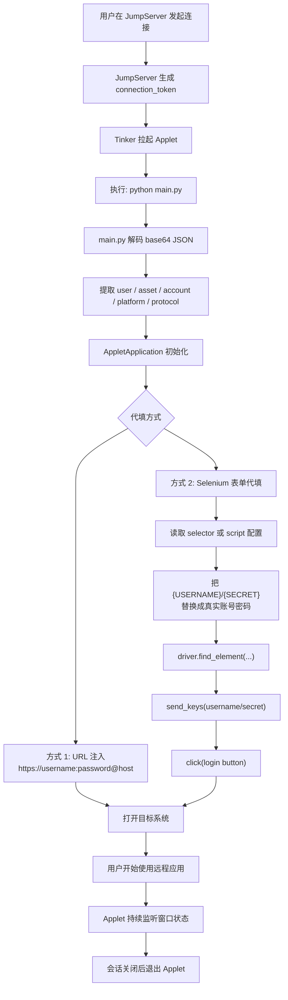
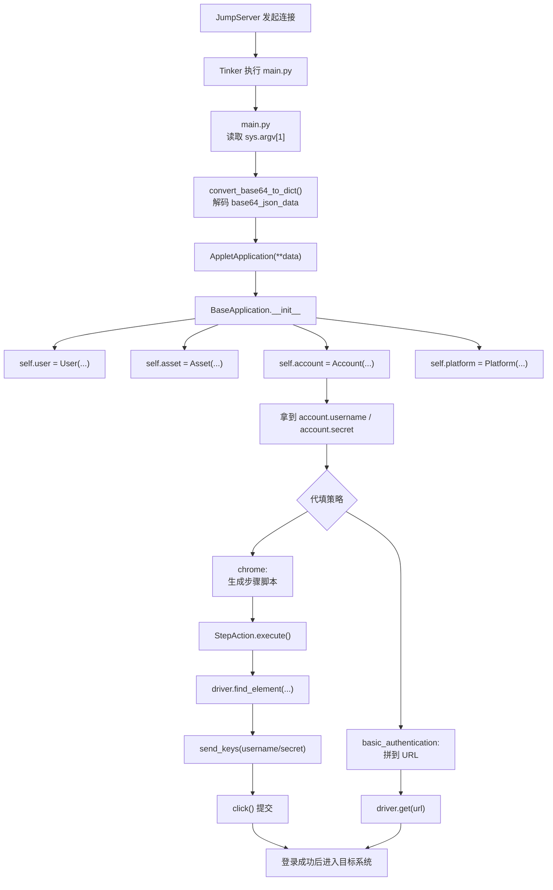
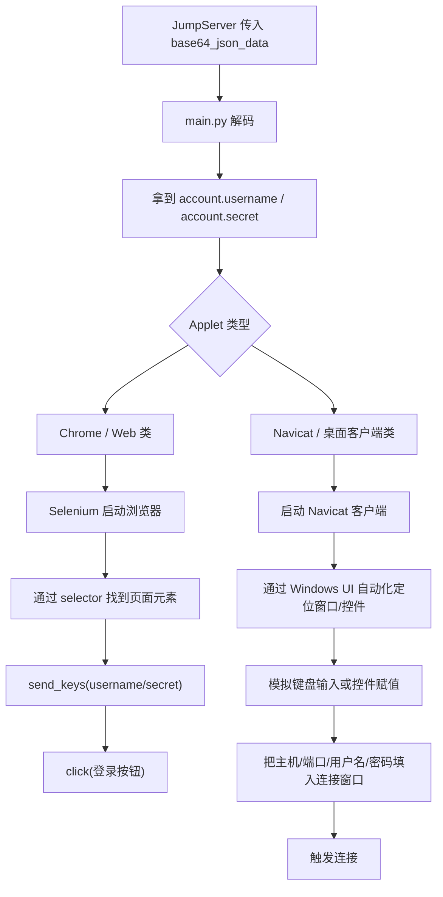
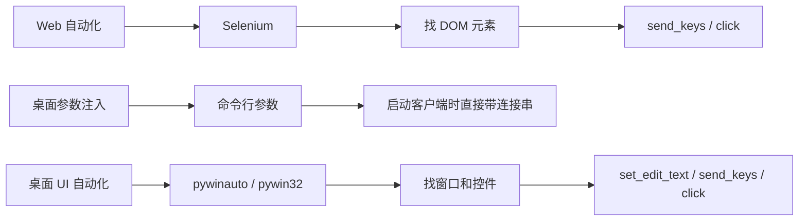

# Project Diagrams

这个文件用于沉淀我们交流过程中产出的流程图、结构图和关键说明。

后续如果我再给你画图，我会优先继续追加到这个文件，或者在内容较大时拆到独立的 Markdown 文档中。

## 1. JumpServer Applet 账号密码代填总流程



## 2. 流程与代码位置对应图



## 3. 当前对应代码位置

- 入口读取参数：
  [`/Users/zevin/Desktop/fit2cloud/code/js-remoteAPP/doc/basic_authentication/main.py`](/Users/zevin/Desktop/fit2cloud/code/js-remoteAPP/doc/basic_authentication/main.py)
- base64 解码：
  [`/Users/zevin/Desktop/fit2cloud/code/js-remoteAPP/doc/basic_authentication/common.py`](/Users/zevin/Desktop/fit2cloud/code/js-remoteAPP/doc/basic_authentication/common.py)
- 基础对象初始化：
  [`/Users/zevin/Desktop/fit2cloud/code/js-remoteAPP/doc/basic_authentication/common.py`](/Users/zevin/Desktop/fit2cloud/code/js-remoteAPP/doc/basic_authentication/common.py)
- 最简 URL 注入代填：
  [`/Users/zevin/Desktop/fit2cloud/code/js-remoteAPP/doc/basic_authentication/app.py`](/Users/zevin/Desktop/fit2cloud/code/js-remoteAPP/doc/basic_authentication/app.py)
- 更完整的 Selenium 表单代填参考：
  [`/Users/zevin/Desktop/fit2cloud/code/js-remoteAPP/ex/chrome.zip`](/Users/zevin/Desktop/fit2cloud/code/js-remoteAPP/ex/chrome.zip)

## 4. 约定

从这次开始，我在对话里输出的图示内容会尽量同步保存在仓库的 Markdown 文件里，方便你后续查看和复用。

## 5. Chrome 与 Navicat 的代填方式对比



## 6. Navicat 代填的当前判断依据

- `navicat/main.py` 与其他 applet 一样，会先解析 JumpServer 传入的 base64 参数。
- `navicat/common.py` 里同样定义了 `account.username` 和 `account.secret`，说明账号密码依然来自 JumpServer 授权数据。
- `navicat/const.py` 只定义了方向键、Tab、Enter、Esc 这类按键常量，明显更像桌面自动化，不像 Web DOM 自动化。
- 项目文档 `Applet+运行环境.doc` 明确说明运行环境内置了 `pywinauto`，并注明它主要用于自动化 Windows 图形化软件。
- 因为 `navicat` 的核心执行文件是加密/编译后的 `app.pye`，当前仓库里无法直接看到明文实现，所以桌面 UI 自动化这个结论是基于现有证据的高概率判断。

## 7. 解压后各实例的关键操作路径

所有完成包已经解压到：

- [`/Users/zevin/Desktop/fit2cloud/code/js-remoteAPP/extracted/chrome`](/Users/zevin/Desktop/fit2cloud/code/js-remoteAPP/extracted/chrome)
- [`/Users/zevin/Desktop/fit2cloud/code/js-remoteAPP/extracted/dbeaver`](/Users/zevin/Desktop/fit2cloud/code/js-remoteAPP/extracted/dbeaver)
- [`/Users/zevin/Desktop/fit2cloud/code/js-remoteAPP/extracted/navicat`](/Users/zevin/Desktop/fit2cloud/code/js-remoteAPP/extracted/navicat)

### Chrome

关键路径：

- 入口：[`/Users/zevin/Desktop/fit2cloud/code/js-remoteAPP/extracted/chrome/main.py`](/Users/zevin/Desktop/fit2cloud/code/js-remoteAPP/extracted/chrome/main.py)
- 核心逻辑：[`/Users/zevin/Desktop/fit2cloud/code/js-remoteAPP/extracted/chrome/app.py`](/Users/zevin/Desktop/fit2cloud/code/js-remoteAPP/extracted/chrome/app.py)

操作路径：

1. `main.py` 解码 JumpServer 传入的 base64 参数。
2. `app.py` 的 `WebAPP.__init__()` 读取 `account.username` 和 `account.secret`。
3. 根据 `autofill=basic` 或 `autofill=script` 生成步骤列表。
4. `StepAction.execute()` 用 Selenium 定位页面元素。
5. 调用 `send_keys()` 和 `click()` 完成代填。

### DBeaver

关键路径：

- 入口：[`/Users/zevin/Desktop/fit2cloud/code/js-remoteAPP/extracted/dbeaver/main.py`](/Users/zevin/Desktop/fit2cloud/code/js-remoteAPP/extracted/dbeaver/main.py)
- 核心逻辑：[`/Users/zevin/Desktop/fit2cloud/code/js-remoteAPP/extracted/dbeaver/app.py`](/Users/zevin/Desktop/fit2cloud/code/js-remoteAPP/extracted/dbeaver/app.py)

操作路径：

1. `main.py` 解码 base64 参数。
2. `AppletApplication.__init__()` 直接读取：
   - `self.account.username`
   - `self.account.secret`
   - `self.asset.address`
   - `self.asset.get_protocol_port(self.protocol)`
3. `_get_exec_params()` 把连接信息拼成启动参数字符串。
4. `run()` 通过 `dbeaver-cli.exe -con ...` 直接启动并连接。

这个模式不是“模拟填表”，而是“把账号密码作为客户端启动参数直接传进去”。

### Navicat

关键路径：

- 入口：[`/Users/zevin/Desktop/fit2cloud/code/js-remoteAPP/extracted/navicat/main.py`](/Users/zevin/Desktop/fit2cloud/code/js-remoteAPP/extracted/navicat/main.py)
- 公共数据模型：[`/Users/zevin/Desktop/fit2cloud/code/js-remoteAPP/extracted/navicat/common.py`](/Users/zevin/Desktop/fit2cloud/code/js-remoteAPP/extracted/navicat/common.py)
- 按键常量：[`/Users/zevin/Desktop/fit2cloud/code/js-remoteAPP/extracted/navicat/const.py`](/Users/zevin/Desktop/fit2cloud/code/js-remoteAPP/extracted/navicat/const.py)
- 核心执行：[`/Users/zevin/Desktop/fit2cloud/code/js-remoteAPP/extracted/navicat/app.pye`](/Users/zevin/Desktop/fit2cloud/code/js-remoteAPP/extracted/navicat/app.pye)

当前可确认路径：

1. `main.py` 解码 base64 参数。
2. `common.py` 把账号密码放进 `self.account.username` / `self.account.secret`。
3. `app.pye` 执行真正的 Navicat 自动化逻辑。

当前高概率判断：

- 它不是 Selenium。
- 它大概率是基于 Windows UI 自动化和键盘事件，把连接信息填进 Navicat 的连接窗口。
- `const.py` 里的 `TAB`、`ENTER`、方向键就是这个判断的重要证据。

### MySQL Workbench

关键路径：

- 入口：[`/Users/zevin/Desktop/fit2cloud/code/js-remoteAPP/extracted/mysql_workbench8/main.py`](/Users/zevin/Desktop/fit2cloud/code/js-remoteAPP/extracted/mysql_workbench8/main.py)
- 核心逻辑：[`/Users/zevin/Desktop/fit2cloud/code/js-remoteAPP/extracted/mysql_workbench8/app.py`](/Users/zevin/Desktop/fit2cloud/code/js-remoteAPP/extracted/mysql_workbench8/app.py)
- 平台字段：[`/Users/zevin/Desktop/fit2cloud/code/js-remoteAPP/extracted/mysql_workbench8/platform.yml`](/Users/zevin/Desktop/fit2cloud/code/js-remoteAPP/extracted/mysql_workbench8/platform.yml)

操作路径：

1. `main.py` 解码 JumpServer 传入的 base64 参数。
2. `app.py` 读取：
   - `self.asset.info.username`
   - `self.asset.info.password`
   - `self.asset.address`
   - `self.asset.info.port`
   - `self.asset.info.db_name`
3. 通过 `pywinauto.Application(backend='uia')` 启动 MySQL Workbench。
4. 用窗口标题、`auto_id`、控件类型定位输入框和按钮。
5. 通过 `EditWrapper(...).set_edit_text(...)` 把 host、port、username、db、password 填入 Workbench 的连接窗口。
6. 用 `ButtonWrapper(...).click()` 触发 OK 和连接。

这个模式是标准的 Windows 桌面 UI 自动化，不是启动参数注入，也不是浏览器 DOM 自动化。

额外说明：

- 这个 applet 使用的用户名和密码，优先来自 `asset.info.username` / `asset.info.password`，而不是统一只从 `account.username` / `account.secret` 读取。
- 但在密码弹窗阶段，又明确使用了 `self.account.secret`。
- 这说明它把“资产自定义字段”和“JumpServer 授权账号”两套数据都用上了。

## 8. Navicat 和 MySQL Workbench 用的是什么技术

### 结论

- `MySQL Workbench`：明确使用了 Python + `pywinauto` + `pywin32` 做 Windows UI 自动化。
- `Navicat`：核心逻辑在编译后的 `app.pye`，但从项目依赖、按键常量和整体结构看，高概率也是 Python + Windows UI 自动化，技术路线与 `MySQL Workbench` 同类。

### MySQL Workbench 的技术点

在 [`/Users/zevin/Desktop/fit2cloud/code/js-remoteAPP/extracted/mysql_workbench8/app.py`](/Users/zevin/Desktop/fit2cloud/code/js-remoteAPP/extracted/mysql_workbench8/app.py) 里可以直接看到：

- `pywinauto.Application(backend='uia')`
- `EditWrapper`
- `ButtonWrapper`
- `MenuItemWrapper`
- `send_keys`
- `win32api`
- `win32con`
- `win32gui`

这说明它不是操作网页，而是在操作 Windows 桌面程序的窗口和控件。

### Navicat 的技术点

在 [`/Users/zevin/Desktop/fit2cloud/code/js-remoteAPP/extracted/navicat/const.py`](/Users/zevin/Desktop/fit2cloud/code/js-remoteAPP/extracted/navicat/const.py) 里能看到：

- `TAB`
- `ENTER`
- `ESC`
- 方向键

再结合运行环境文档里提供的依赖：

- `pywinauto`
- `pywin32`

可以合理判断 `Navicat` 的实现大概率包括：

- 启动 `navicat.exe`
- 定位顶层窗口和连接弹窗
- 通过控件定位或键盘事件切换焦点
- 输入主机、端口、用户名、密码
- 触发连接

## 9. UI 自动化具体涉及什么

这里说的 UI 自动化，指的是自动操作 Windows 桌面应用程序界面，不是浏览器自动化。

通常会涉及这几类能力：

### 1. 启动应用

- 启动 EXE 或 MSI 安装后的程序
- 例如直接启动 `MySQLWorkbench.exe` 或 `navicat.exe`

### 2. 查找窗口

- 找主窗口
- 找弹窗
- 判断窗口是否已经出现、可见、可操作

常见定位条件：

- 窗口标题
- `auto_id`
- 控件类型
- 类名

### 3. 查找控件

常见控件包括：

- 输入框 `Edit`
- 按钮 `Button`
- 菜单 `MenuItem`
- 下拉框 `ComboBox`
- 工具栏 `Toolbar`

### 4. 向控件写值

常见方式有两种：

- 直接对输入框赋值，比如 `set_edit_text(...)`
- 模拟键盘输入，比如 `send_keys(...)`

### 5. 触发交互

例如：

- 点击按钮
- 选择菜单
- 按 `Tab` 切换焦点
- 按 `Enter` 确认
- 按方向键切换选项

### 6. 等待和同步

桌面 UI 自动化很依赖等待机制，否则容易因为窗口还没出来就找控件失败。

常见动作：

- 等待窗口 ready
- 等待弹窗出现
- 重试查找控件

### 7. 处理多窗口和多步骤流程

例如数据库客户端常见流程：

1. 打开主界面
2. 进入 `Connect to Database`
3. 弹出连接配置框
4. 填写 host/port/user/db
5. 点击 OK
6. 再弹密码框
7. 输入密码并确认

### 8. 处理网关/跳板机场景

像 `mysql_workbench8` 里还包含：

- SSH Host
- SSH Username
- Gateway Password

这说明 UI 自动化不只是填一次表，往往是多段式连接配置。

## 10. 这个项目里三种自动化技术的区别



## 11. pywinauto 控件定位实战笔记

这部分专门回答三个问题：

1. `title` 是什么
2. `auto_id` 是什么
3. `control_type` 是什么

以及它们平时怎么拿到。

### 11.1 三个核心属性分别是什么

#### `title`

就是控件在 Windows UI 自动化树里的显示名称，通常对应：

- 窗口标题
- 按钮文字
- 菜单项文字
- 输入框的可见名称

例子：

- `MySQL Workbench`
- `Database`
- `Connect to Database`
- `Host Name`
- `Password`
- `OK`

在这个项目里对应代码：

- 主窗口：[`app.py#L47`](/Users/zevin/Desktop/fit2cloud/code/js-remoteAPP/extracted/mysql_workbench8/app.py#L47)
- 菜单项：[`app.py#L51`](/Users/zevin/Desktop/fit2cloud/code/js-remoteAPP/extracted/mysql_workbench8/app.py#L51)
- Host 输入框：[`app.py#L123`](/Users/zevin/Desktop/fit2cloud/code/js-remoteAPP/extracted/mysql_workbench8/app.py#L123)

#### `auto_id`

这是 Windows UI Automation 里的 AutomationId。

它通常由桌面应用开发者在控件上定义，特点是：

- 比纯文本标题更稳定
- 不一定每个控件都有
- 有时会和标题相同
- 有时是一串开发内部 ID

在这个项目里常见值：

- `MainForm`
- `Host Name`
- `Port`
- `User Name`
- `Password`
- `Connection`

示例：

```python
app.window(title="MySQL Workbench", auto_id="MainForm", control_type="Window")
```

#### `control_type`

这是控件类型，也就是 UIA 树里的控件类别。

在这个项目里你已经见到的有：

- `Window`
- `MenuItem`
- `Edit`
- `Button`
- `Pane`

例子：

- 主程序窗口是 `Window`
- 菜单项是 `MenuItem`
- 输入框是 `Edit`
- 确认按钮是 `Button`

### 11.2 在代码里怎么组合使用

最常见写法就是：

```python
app.top_window().child_window(
    title="Host Name",
    auto_id="Host Name",
    control_type="Edit"
)
```

意思是：

1. 先拿当前最上层窗口
2. 在它下面找一个子控件
3. 这个子控件必须同时满足：
   - 名字叫 `Host Name`
   - AutomationId 是 `Host Name`
   - 类型是 `Edit`

找到后再包装成对应控件类型：

```python
EditWrapper(host_ele.element_info).set_edit_text(self.host)
```

### 11.3 为什么有时要三个条件一起用

因为只用一个条件容易撞到别的控件。

例如只用：

```python
child_window(title="OK")
```

如果当前界面有多个 `OK`，就容易拿错。

所以通常会用更稳的组合：

```python
child_window(title="Connection", auto_id="Connection", control_type="Window") \
    .child_window(title="OK", control_type="Button")
```

先缩小到具体弹窗，再找按钮，这样稳定很多。

### 11.4 这个项目里有哪些真实例子

#### 例子 1：定位主窗口

代码：

```python
app.window(title="MySQL Workbench", auto_id="MainForm", control_type="Window")
```

含义：

- 找标题是 `MySQL Workbench` 的窗口
- 这个窗口的 AutomationId 是 `MainForm`
- 类型必须是 `Window`

#### 例子 2：定位菜单

代码：

```python
.child_window(title="Database", control_type="MenuItem")
```

含义：

- 在主窗口下面找一个菜单项
- 这个菜单项显示文字是 `Database`

#### 例子 3：定位输入框

代码：

```python
app.top_window().child_window(
    title="User Name",
    auto_id="User Name",
    control_type="Edit"
)
```

含义：

- 在当前连接窗口里找用户名输入框

#### 例子 4：定位按钮

代码：

```python
app.top_window().child_window(
    title="Button Bar",
    auto_id="Button Bar",
    control_type="Pane"
).child_window(title="OK", control_type="Button")
```

含义：

- 先找按钮容器 `Button Bar`
- 再在这个容器下面找 `OK` 按钮

### 11.5 这些属性平时怎么抓出来

最常用的方式不是猜，而是看目标程序的 UIA 树。

常见工具有两个：

- `Inspect.exe`
- `pywinauto` 自带的 `print_control_identifiers()`

#### 方法 1：用 Inspect.exe

这是 Windows SDK 里的工具，专门看 UI Automation 信息。

你把鼠标移到某个控件上，一般能直接看到：

- Name
- AutomationId
- ControlType
- ClassName

对应关系大致是：

- `Name` -> `title`
- `AutomationId` -> `auto_id`
- `ControlType` -> `control_type`

这是最直接、最实用的抓法。

#### 方法 2：用 pywinauto 打印控件树

示例：

```python
from pywinauto import Application

app = Application(backend="uia").start(r"C:\Program Files\MySQL\MySQL Workbench 8.0 CE\MySQLWorkbench.exe")
dlg = app.top_window()
dlg.print_control_identifiers()
```

这个会把当前窗口下的控件树打印出来，通常能看到：

- 窗口层级
- 控件名称
- 控件类型
- 可访问的定位别名

开发这类 applet 时，这个方法很常用。

### 11.6 如果拿不到精确控件怎么办

这时一般有三种补救方式。

#### 方式 1：缩小父窗口范围

不要全局找，先找具体弹窗，再找子控件。

#### 方式 2：换定位字段

除了 `title / auto_id / control_type`，有时还会加：

- `class_name`
- `found_index`
- 相邻控件关系

#### 方式 3：退回键盘自动化

如果控件树不好拿，或者 UIA 信息不稳定，就用：

- `send_keys("{TAB}")`
- `send_keys("{ENTER}")`
- `send_keys("{DOWN}")`

这也是为什么 `navicat/const.py` 里会有这些按键常量。

### 11.7 为什么 Navicat 很可能也是这套路

虽然 [`/Users/zevin/Desktop/fit2cloud/code/js-remoteAPP/extracted/navicat/app.pye`](/Users/zevin/Desktop/fit2cloud/code/js-remoteAPP/extracted/navicat/app.pye) 不是明文，但结合：

- [`/Users/zevin/Desktop/fit2cloud/code/js-remoteAPP/extracted/navicat/const.py`](/Users/zevin/Desktop/fit2cloud/code/js-remoteAPP/extracted/navicat/const.py)
- 项目依赖里的 `pywinauto`
- `mysql_workbench8` 的明文样例

基本可以推断它也是：

1. 启动客户端
2. 找窗口
3. 找控件或切焦点
4. 填值
5. 点击连接

### 11.8 开发这类 applet 的实际工作流

通常是这样：

1. 手动打开目标客户端
2. 用 `Inspect.exe` 看每个关键控件的 `Name / AutomationId / ControlType`
3. 先写出主窗口定位
4. 再写输入框定位
5. 再写按钮点击
6. 失败时用 `print_control_identifiers()` 补树结构
7. 实在不稳定就改成 `send_keys` 辅助
细节 1： 这个 base64_json_data 是唯一的输入。所有的资产信息（IP、端口）、账号信息（用户名、密码）都封装在这个加密字符串里。

2. 核心结构：一个完整的 Applet 包含哪些文件？
我们按照规范，创建一个名为 mysql_demo 的新目录，并逐步建立以下结构：

manifest.yml: 基础元数据（名、版本）。
setup.yml: 描述如何在 Windows 节点上安装这个应用（比如它是 ZIP 还是 EXE 下载）。
platform.yml: 定义在 JumpServer 后台看到的资产协议映射关系。
main.py: 解析入口，负责解码 base64 并分发任务。

common.py
: 提供基类，封装通用的异常处理、PID 等待逻辑。

app.py
: 业务核心，利用 pywinauto 执行具体的桌面自动化（填表、点击）。